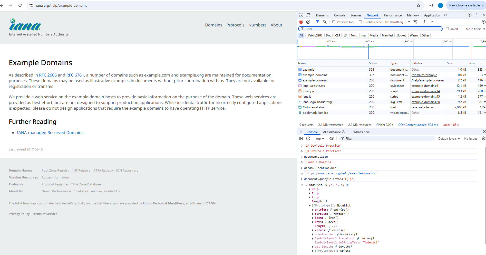

# DevTools practise

## 1. Used webside:

https://www.iana.org/help/example-domains

## 2. Tried commands:

- console.log('QA DevTools Practice')
- document.title
- window.location.href
- document.querySelectorAll('p')

### 3. Results:

| Command                             | Result                                                                                    |
| ----------------------------------- | ----------------------------------------------------------------------------------------- |
| console.log('QA DevTools Practice') | Print "QA DevTools Practice" in the console                                               |
| document.title                      | Get the title of the page: "Example Domains"                                              |
| window.location.href                | Return currently loaded URL in the address bar: https://www.iana.org/help/example-domains |
| document.querySelectorAll('p')      | Return a NodeList containing all pharagraph elements on the page                          |

## 4. Benefits for upcoming testing:

1. console.log can be used for debugging to track whether certain parts of code are executed by logging inside conditionals.
2. Accessing the title can verify if the correct page is loaded.
3. window.location.href can validate if the user is redirected to the expected URL after certain action.
4. document.querySelectorAll('p') is useful for selecting and asserting elements on the page.

## 5. Screenshots:

